# 🧁 Sweet Bites – React Dessert Cart

A shopping cart for a dessert shop, built with **React 18**, **Redux Toolkit** and **Framer Motion**.
Pick desserts, watch them fly into your cart, adjust quantities and download a PDF invoice when you confirm the order.
It works on phones, tablets and desktops.

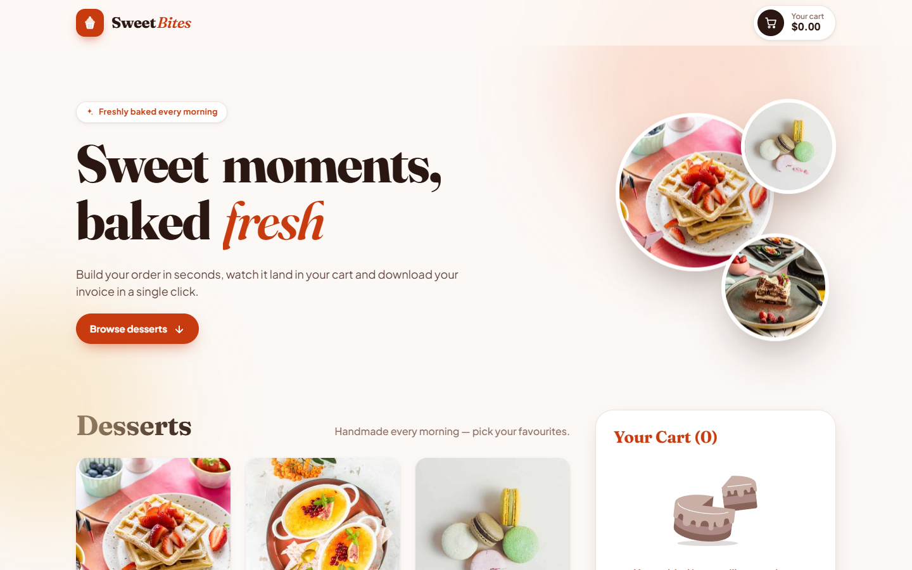

---

## ✨ Features

- **Product grid** with 9 desserts. The data loads through a simulated API call and shows shimmer skeletons while loading.
- **Add to cart.** The button turns into a `− qty +` counter. Selected cards get an accent outline and an "In cart" badge.
- **Cart panel** with line totals, an animated order total, a remove button per item and a _Clear Cart_ button.
- **Order confirmation modal.** It is a centered dialog on desktop and a bottom sheet on phones.
- **PDF invoice.** The invoice is generated with `html2canvas` + `jsPDF`. Both libraries load lazily, only when the user confirms an order.
- **Toast notifications** for removing an item, clearing the cart and confirming an order.
- **Sticky header** with a live cart badge and total. Clicking it scrolls to the cart.
- **Floating "View cart" bar** on tablets and phones. It hides itself while the cart is on screen.
- **Animated 404 page**, a scroll-to-top button and a footer with contact and portfolio links.

## 🎬 Animations

| Where            | What happens                                                                                                                         |
| ---------------- | ------------------------------------------------------------------------------------------------------------------------------------ |
| Add to cart      | A copy of the product image **flies along a curve into the header cart**, sprinkles burst from the button, and the cart icon wiggles |
| Quantity / badge | Numbers **roll like an odometer** (up when increasing, down when decreasing)                                                         |
| Prices           | Totals **count up/down** smoothly to their new value                                                                                 |
| Add ↔ counter    | The pill button morphs between the two states with a spring                                                                          |
| Cart items       | Items slide in, collapse out when removed, and the list re-flows with layout animations                                              |
| Product cards    | Staggered fade-up on scroll, image zoom and lift on hover                                                                            |
| Hero             | Word-by-word title reveal, floating dessert bubbles, drifting background glow                                                        |
| Modal            | Spring scale-in (desktop) or slide-up sheet (mobile), animated checkmark, staggered order list                                       |
| Order confirmed  | 🎉 Full-screen confetti + success toast                                                                                              |
| Footer / 404     | Reveal-on-scroll columns, bouncing social icons, gradient portfolio button, floating "404"                                           |

All motion follows the user's **`prefers-reduced-motion`** setting. Framer Motion uses `MotionConfig reducedMotion="user"`, and the CSS animations are disabled under that setting too.

## 📱 Responsive layout

| Width         | Layout                                                        |
| ------------- | ------------------------------------------------------------- |
| ≥ 1200px      | 3-column product grid + sticky cart sidebar                   |
| 1024 – 1199px | Fluid grid + narrower sticky cart sidebar                     |
| 640 – 1023px  | Fluid grid, cart below the products, floating "View cart" bar |
| < 640px       | Single column, compact header, bottom-sheet modal             |

## 📸 Screenshots

### Desktop

| Home                                  | Cart with items                       |
| ------------------------------------- | ------------------------------------- |
|  | 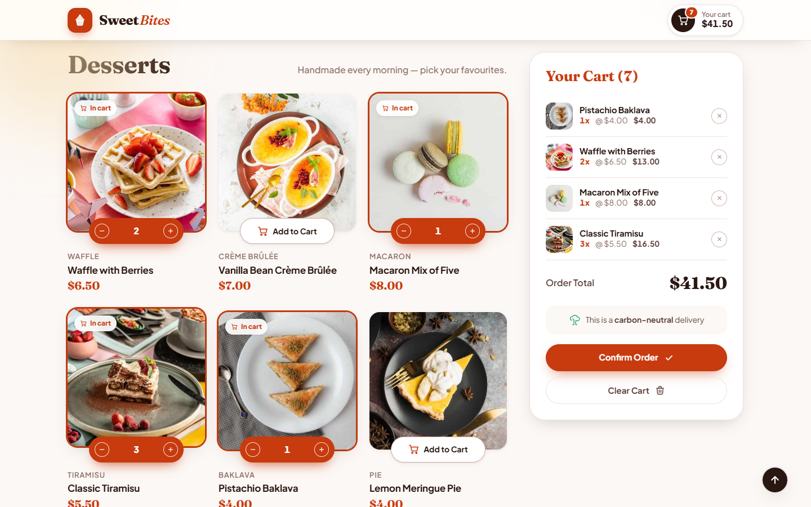 |

| Fly-to-cart animation (mid-flight)                  | Loading skeletons                           |
| --------------------------------------------------- | ------------------------------------------- |
| 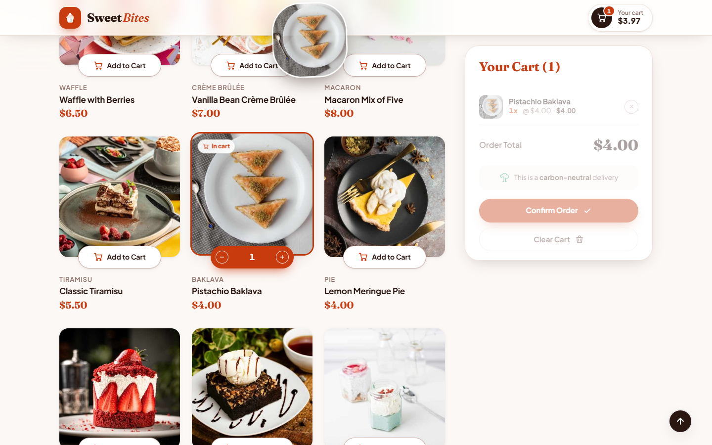 | 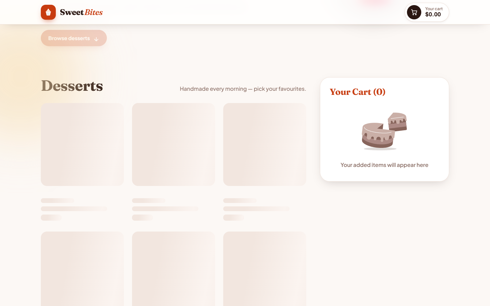 |

| Confirm order modal                     | Order confirmed (confetti + toast)                          |
| --------------------------------------- | ----------------------------------------------------------- |
| 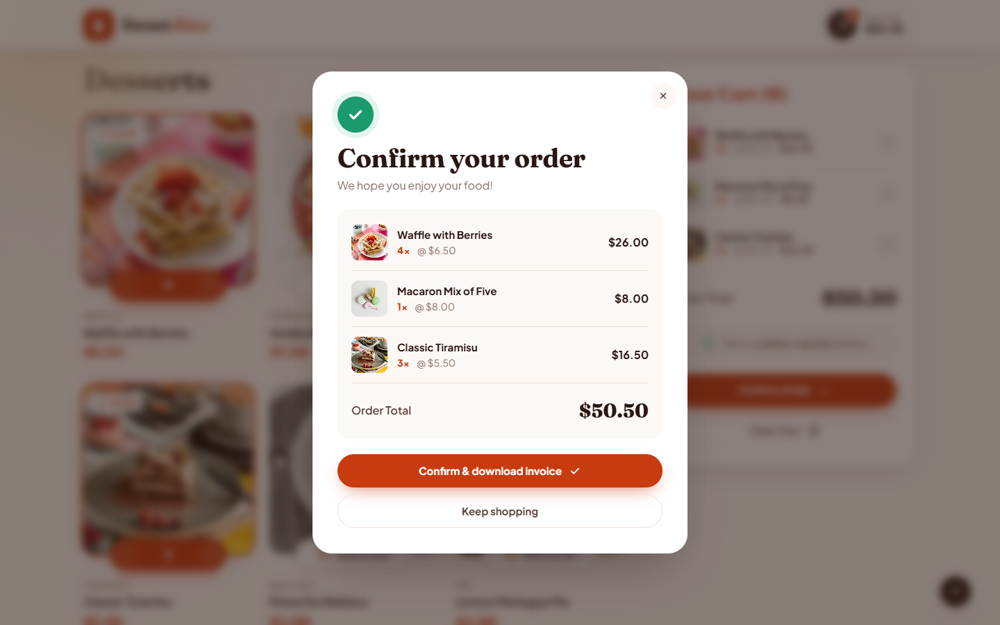 | 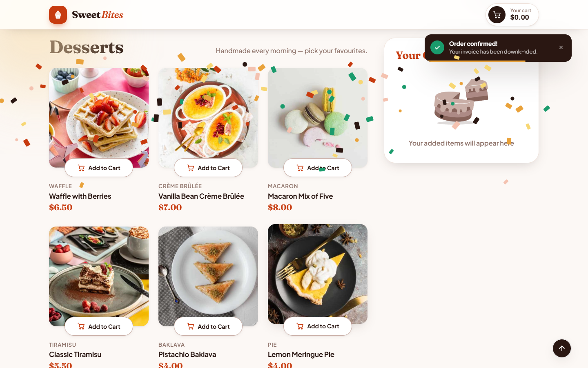 |

| Toast when removing an item             | Footer                                    |
| --------------------------------------- | ----------------------------------------- |
| 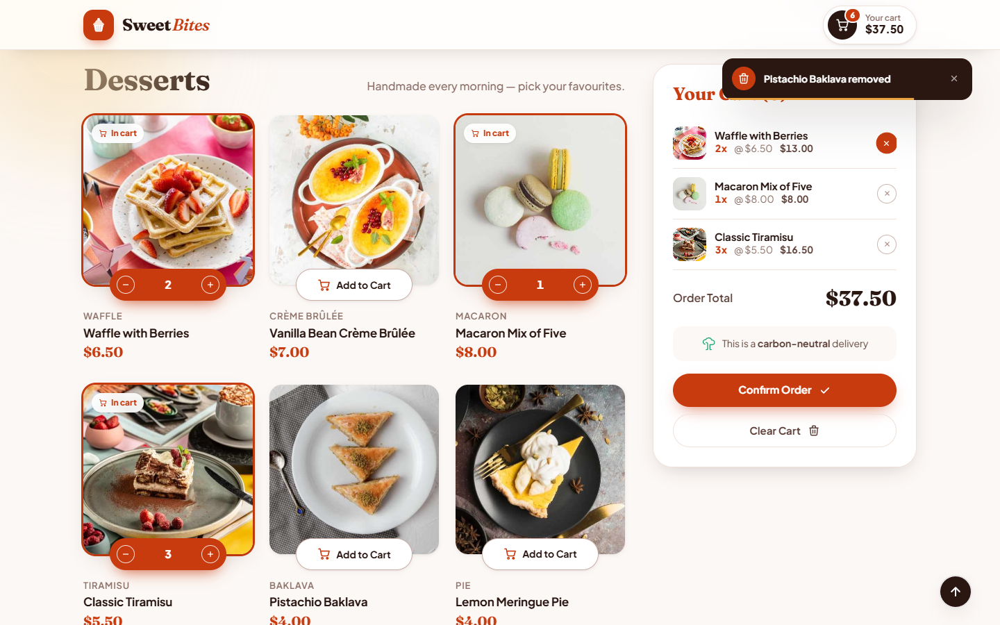 | 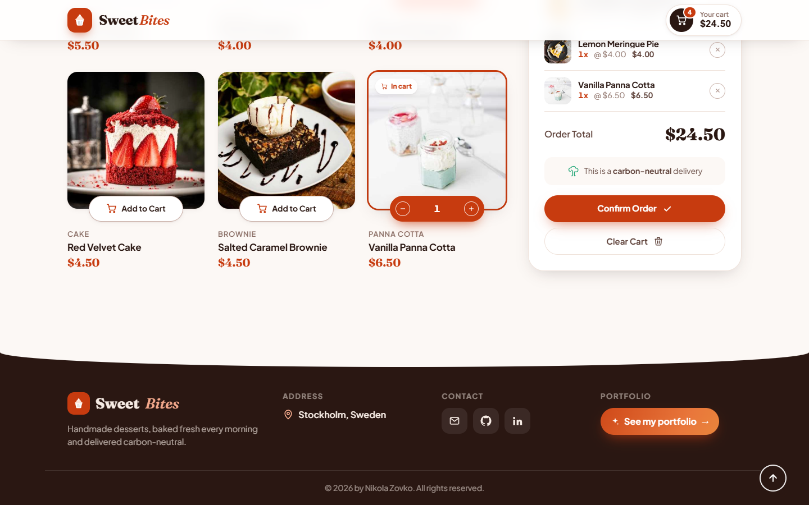 |

| 404 page                            | Generated PDF invoice                   |
| ----------------------------------- | --------------------------------------- |
| 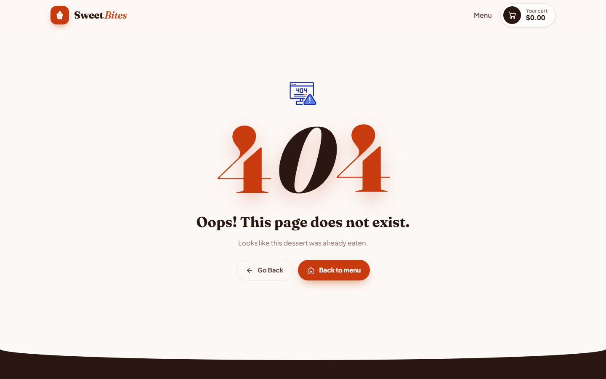 | 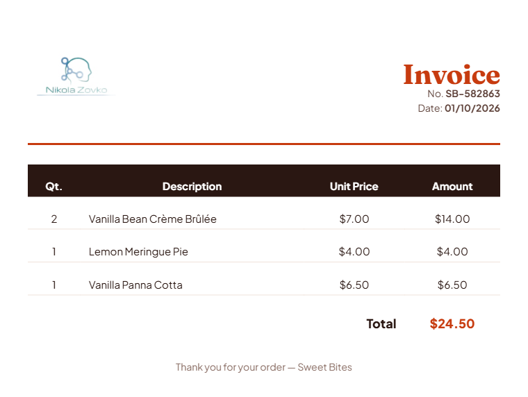 |

### Tablet

| Home                                                                    | Cart                                                                    |
| ----------------------------------------------------------------------- | ----------------------------------------------------------------------- |
| 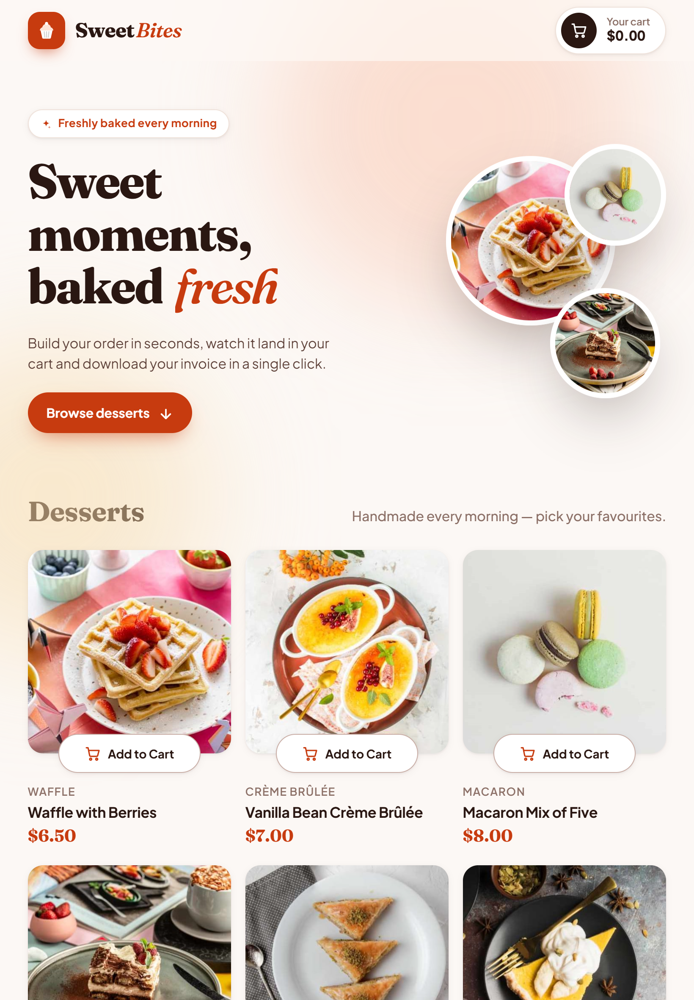 | 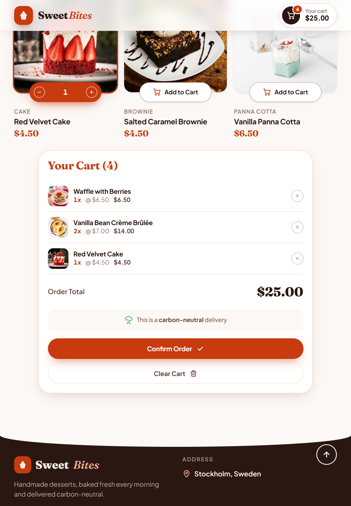 |

### Mobile

| Home                                                                    | Floating cart bar                                                               | Cart                                                                    | Bottom-sheet modal                                                        |
| ----------------------------------------------------------------------- | ------------------------------------------------------------------------------- | ----------------------------------------------------------------------- | ------------------------------------------------------------------------- |
| 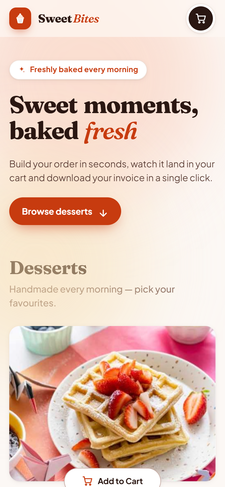 | 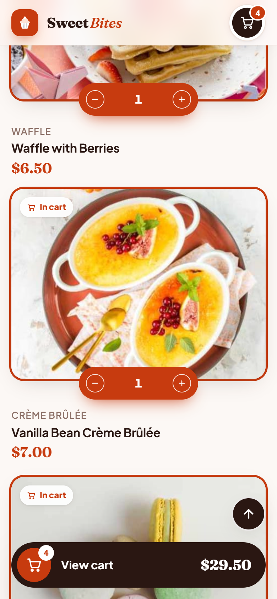 | 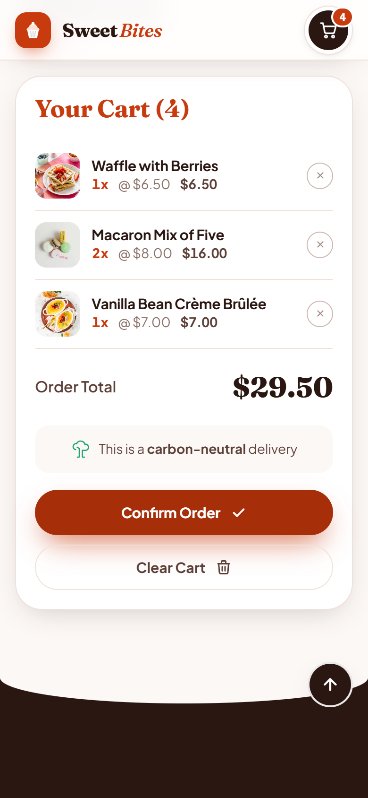 | 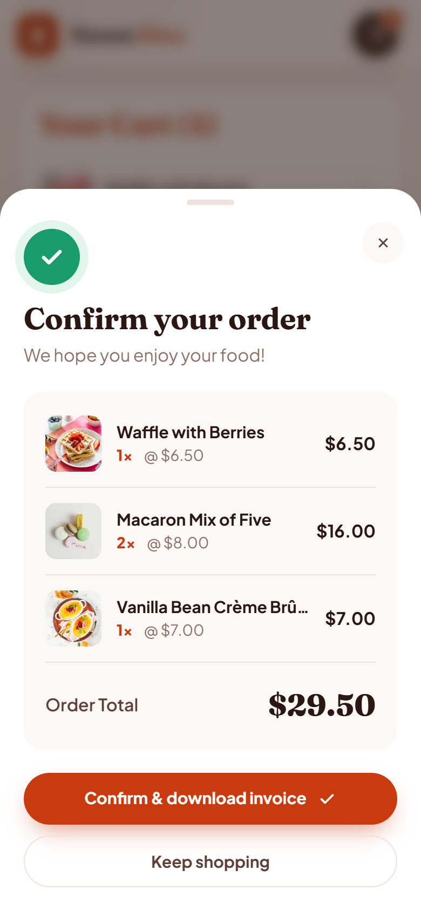 |

## 🛠 Tech stack

- [React 18](https://react.dev/) + [Vite 6](https://vite.dev/)
- [Redux Toolkit](https://redux-toolkit.js.org/) + React Redux for cart state
- [Framer Motion](https://www.framer.com/motion/) for animations
- [React Router 6](https://reactrouter.com/)
- [html2canvas](https://html2canvas.hertzen.com/) + [jsPDF](https://github.com/parallax/jsPDF) for the invoice
- Plain CSS with design tokens (CSS custom properties), fonts: _Fraunces_ + _Plus Jakarta Sans_

## 👤 Author

**Nikola Zovko** – Stockholm, Sweden

- 🌐 Portfolio: [nikolazovkoportfolio.netlify.app](https://nikolazovkoportfolio.netlify.app/#home)
- 💻 GitHub: [@Nikolaz95](https://github.com/Nikolaz95/ReactJS-Cart)
- 💼 LinkedIn: [Nikola Zovko](https://www.linkedin.com/in/nikola-zovko-a50779247/)
- ✉️ Email: [nikolajoe95@gmail.com](mailto:nikolajoe95@gmail.com)
